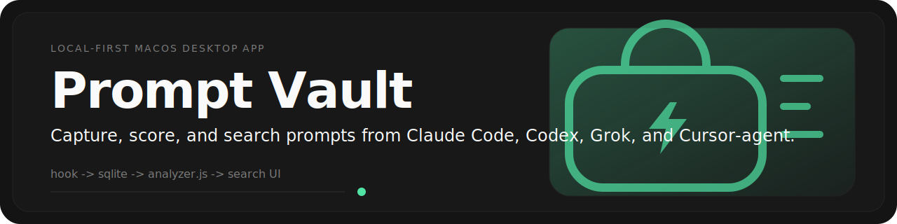
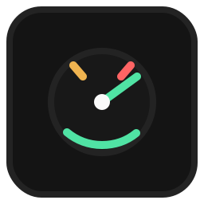
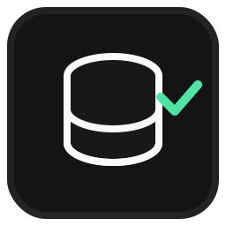
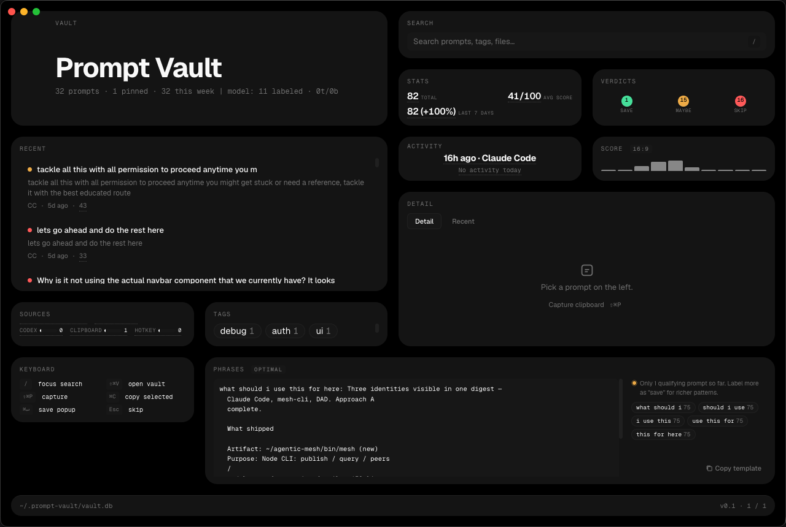
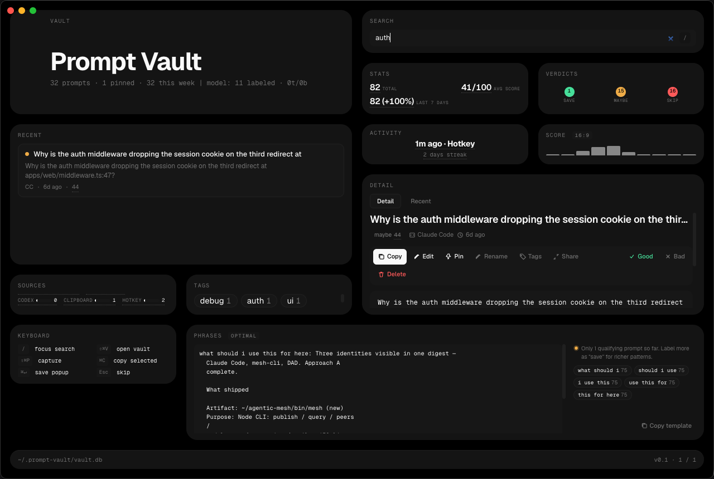
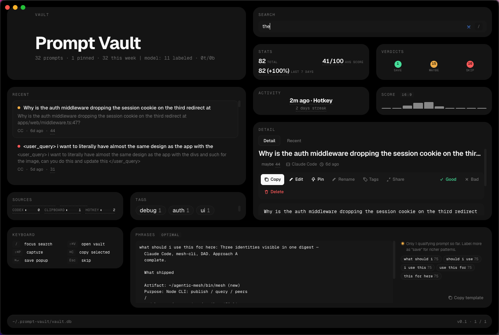

<p align="center">
  
</p>

<p align="center">
  
  
  
  <a href="https://github.com/DevvGwardo/prompt-vault/releases"></a>
</p>

Prompt Vault is a local-first macOS desktop app for capturing the prompts you send through agent tooling, scoring them offline, and making them searchable later. It stores data in SQLite with `better-sqlite3`, analyzes prompt quality in `analyzer.js`, and surfaces everything in an Electron renderer built for fast keyboard-heavy browsing.

## Features

| | |
| --- | --- |
|  | **Capture from your real workflow**. Prompt Vault accepts prompts through its local hook flow, including Claude Code hook wiring and active watchers for Codex and Grok sessions. |
|  | **Score prompts offline**. `analyzer.js` assigns a score, verdict, and reasons so you can separate strong prompts from throwaways. |
|  | **Search fast**. Prompts are stored in SQLite and indexed with FTS5 for quick search across text, title, and tags. |
|  | **Stay local-first**. The vault lives in `~/.prompt-vault/vault.db` by default, with no cloud service required. |

## Supported Agents

- Claude Code
- Codex
- Grok
- Cursor-agent

## Install

Download the latest macOS DMG from [GitHub Releases](https://github.com/DevvGwardo/prompt-vault/releases).

## Build From Source

```bash
npm install
npm start
npm run dist
```

Current package version: `0.1.1`

## How It Works

1. A local hook or watcher captures a prompt from your agent workflow.
2. Prompt Vault stores the prompt, metadata, and recent activity in SQLite.
3. `analyzer.js` scores the prompt and attaches a verdict plus reasons.
4. The Electron renderer lets you search, inspect, pin, and revisit prompts in the vault UI.

## Screenshots

<p align="center">
  
</p>
<p>
  
  
</p>

## License

MIT
